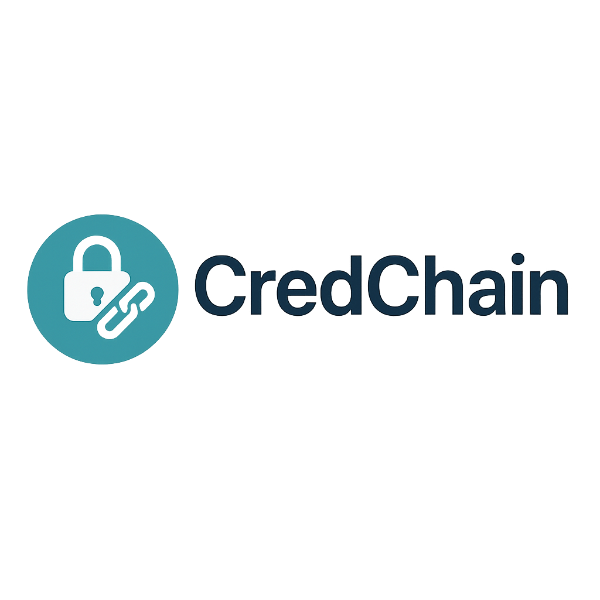
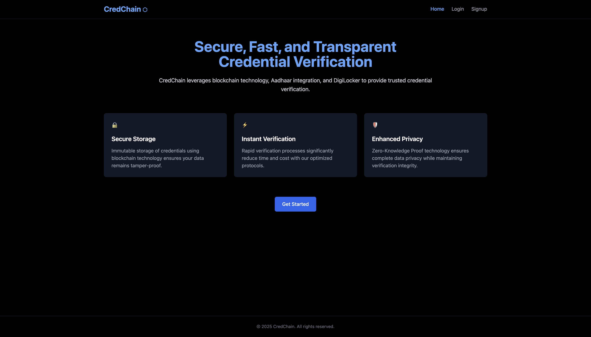
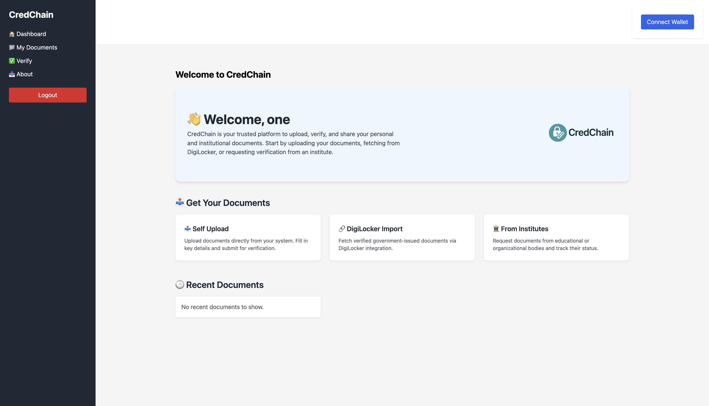

# Decentralized Web3 Credential Verification Platform

  

 

### Transforming Credential Verification in the Digital Age

CredChain is an innovative blockchain-based solution revolutionizing employment and academic credential verification. Leveraging Algorand’s high-performance blockchain technology, Aadhaar-based identity verification, and DigiLocker integration, CredChain ensures secure, fast, and trustworthy verification of credentials.

### CredChain Homepage

  

### CredChain Dashboard

  

---

## Why CredChain?

In today's competitive professional landscape, verifying the authenticity of employment histories, academic degrees, certifications, and professional achievements is critical yet cumbersome. Traditional credential verification methods:

- ⏳ Are time-consuming and manual
- 🛡️ Lack security and are prone to forgery
- 🔄 Cause redundant verifications across organizations
- 🔓 Expose sensitive personal data to multiple parties

CredChain solves these critical challenges with Instant Verification, Fraud Prevention, User Control, and Privacy-First Approach through blockchain-powered transparency, immutability, and security.

---

## 🌐 Key Features

- **Blockchain-Immutable Records:** Credentials securely stored on Algorand blockchain, ensuring data authenticity and preventing fraud.
- **Aadhaar Identity Integration:** Robust identity verification through India's Aadhaar system ensures authentic user onboarding.
- **Seamless DigiLocker Integration:** Automatic retrieval and verification of digital certificates directly from government-issued DigiLocker accounts.
- **Zero-Knowledge Proof (ZKP):** Allows selective disclosure of verified credentials without compromising personal privacy.
- **Smart Contract-Based Workflow:** Automated, transparent, and efficient credential verification process, minimizing human intervention and errors.

---

## 🔧 Tech Stack

| Component | Technologies |
|-----------|--------------|
| Blockchain | Algorand |
| Smart Contracts | Algorand TEAL/Beaker |
| Frontend | React, Flutter |
| Backend | Node.js, Express |
| Identity Verification | Aadhaar e-KYC |
| Credential Storage | DigiLocker API |
| Privacy & Security | Zero-Knowledge Proofs (zk-SNARKs), AES Encryption |

---

## Potential Use Cases

- **Recruitment & Staffing Agencies:** Efficient, automated background checks.
- **Higher Education Institutions:** Secure issuance and verification of academic degrees and certificates.
- **Freelancer Platforms:** Trusted verification of freelancer qualifications and past work.
- **Enterprise HR Departments:** Rapid onboarding with reliable credential verification.

---

## 💡 Expected Impact

- ✅ **Enhanced Trust:** Transparent, immutable credential verification.
- ✅ **Significant Cost Reduction:** Lower verification costs and processing time from weeks to minutes.
- ✅ **Privacy Protection:** Users have complete control over who accesses their verified credentials.
- ✅ **Regulatory Compliance:** Fully compliant with India’s digital privacy and data protection regulations.
- ✅ **Market Leader Potential:** Establishing CredChain as a trusted standard for credential verification globally.

---

## 🤝 Get Involved

We welcome developers, blockchain enthusiasts, educational institutions, and organizations to contribute, collaborate, and innovate together. Your ideas, feedback, and contributions help shape the future of credential verification.

- 🌟 **Star this repo** to support CredChain!
- 📩 **Fork, contribute, and submit pull requests!**

---

## Connect With Us

For collaboration opportunities, inquiries, or investor information:

- **Email:** your.email@example.com
- **LinkedIn:** [credchain](www.linkedin.com/in/credchain)
- **Website:** [CredChain Official Site](https://credchain.example.com)

---

**Together, let's redefine trust in professional and academic credential verification!** 🚀
